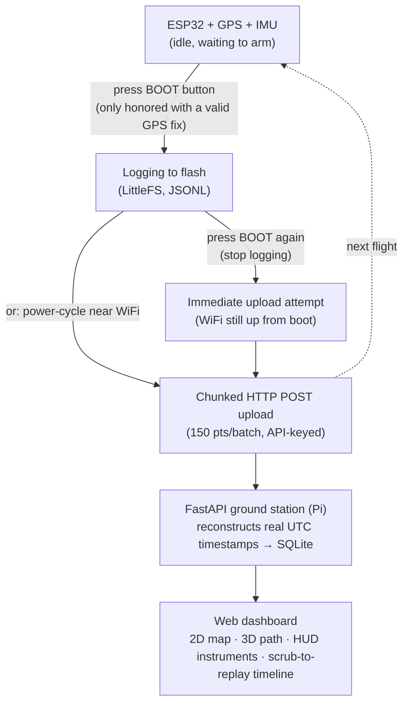

<div align="center">

# 🛩️ Drone Flight Logger

**Untethered GPS + IMU flight logging for a bare ESP32, with automatic upload and a HUD-style 2D/3D playback dashboard.**

No flight controller. No telemetry radio. Just an ESP32, a GPS module, and an IMU — logging to flash in the air, and syncing to a Raspberry Pi ground station the moment it's back on WiFi.

`ESP32 Firmware` · `FastAPI + SQLite Backend` · `Leaflet + Three.js Frontend`

</div>

---

## Table of contents

- [How it works](#how-it-works)
- [Status LEDs](#status-leds)
- [Hardware](#hardware)
- [Repo layout](#repo-layout)
- [1 · Firmware setup](#1--firmware-setup)
- [2 · Backend setup](#2--backend-setup)
- [3 · Running the dashboard](#3--running-the-dashboard)
- [Data model](#data-model)
- [Design notes & gotchas](#design-notes--gotchas)
- [Roadmap](#roadmap)

---

## How it works



1. **On boot**, the ESP32 tries WiFi for a few seconds. If it connects, it syncs real time over NTP and uploads any flight log left over from the last flight — then clears it. A dedicated **CALIBRATE_LED** and **UPLOAD_LED** give a visual readout of each of these boot-time stages; see [Status LEDs](#status-leds).
2. It then sits idle, waiting for the **BOOT button (GPIO0)** to arm logging — but the button only actually does anything once there's a **valid GPS fix**. The **READY_LED** communicates this live: off with no fix, slow-blinking once GPS alone is good, fast-blinking once GPS *and* the IMU are both good to go.
3. Once armed, it logs **GPS fixes (~5 Hz)** and **IMU samples (~50 Hz)** as interleaved JSONL to onboard flash, timestamped with milliseconds-since-boot — no live clock needed in the air. A separate onboard heartbeat LED confirms data is actively being written (see [Status LEDs](#status-leds) — this replaced an earlier per-point flash that was too fast to see).
4. Orientation (roll/pitch/yaw) is computed **on the ESP32 itself** via a quaternion-based Madgwick AHRS filter, with continuous gyro-bias learning to track thermal drift.
5. **Pressing BOOT a second time while a flight is being logged stops it** — logging LED off, and it tries to upload immediately over the WiFi connection that's been open since boot, rather than requiring a reboot to trigger the upload. If WiFi isn't connected at that point, it falls back to the normal "kept on flash for retry next boot" behavior (3 UPLOAD_LED flashes).
6. Back near WiFi, the whole flight uploads in small batches to avoid ESP32 heap exhaustion, and the **FastAPI backend** reconstructs true UTC timestamps by anchoring each point to the batch's known first/last millisecond offsets.
7. The **web dashboard** — served straight off the Raspberry Pi — renders the flight path on a 2D Leaflet map and a 3D Three.js scene, with a HUD of altitude/speed tapes, an attitude indicator, GPS/battery/vibration readouts, and a scrub-to-replay timeline.

---

## Status LEDs

Four onboard LEDs give a full at-a-glance readout of firmware state without needing a serial monitor connected.

| LED | Pin | Meaning |
|---|---|---|
| **CALIBRATE_LED** | GPIO32 | On solid for the ~5s gyro bias calibration at boot (board must stay still). Off once done. Only runs if an IMU is detected. |
| **UPLOAD_LED** | GPIO33 | On solid while a pending flight log is actively uploading over WiFi. When finished: **1 flash** = uploaded successfully, **2 flashes** = checked and there was nothing pending, **3 flashes** = upload failed (log kept on flash for retry next boot). |
| **READY_LED** | GPIO25 | Reflects live GPS/IMU status while idle, rechecked continuously (not just once at boot): **off** = no valid GPS fix yet, BOOT button is ignored · **slow blink** (~1.25 Hz) = valid GPS, no/invalid IMU — safe to arm, GPS-only · **fast blink** (~4 Hz) = valid GPS *and* valid IMU — everything's good. |
| **Onboard LED (heartbeat)** | GPIO2 | While logging, toggles on a fixed, clearly-visible ~400ms cadence, but *only* if at least one GPS/IMU point was actually written since the last toggle. Steady blinking = data is flowing normally; if it stops blinking and goes dark mid-flight, writes have stalled (lost GPS fix and no IMU). |

All three status LEDs (CALIBRATE_LED, UPLOAD_LED, READY_LED) turn off the moment logging starts, since only the heartbeat LED is relevant once armed.

> **Why the heartbeat LED changed:** the original implementation flashed once per data point written. That works fine for GPS at ~5 Hz, but IMU samples arrive every ~20ms (50 Hz) — far faster than the LED can visibly turn on and off, and faster than the eye can resolve as discrete flashes anyway. It now tracks "was *any* point written in the last ~400ms" and toggles on that fixed interval instead, which is both visible and still an accurate live indicator that logging hasn't silently stalled.

> **Why the BOOT button now requires a GPS fix:** previously the button worked as soon as setup finished, even with zero satellites in view, silently starting a flight log that might be GPS-less for a while. GPS fix validity (including a staleness check — a fix older than 3s no longer counts) and IMU sanity (finite, plausible-magnitude readings, rechecked every 200ms) are now both tracked continuously while idle, and only a valid GPS fix is required to arm — IMU is a bonus indicator (fast vs. slow blink) since logging still works fine GPS-only if no IMU is installed.

---

## Hardware

| Component | Notes |
|---|---|
| ESP32 DevKit | Any common dev board with onboard LED (GPIO2) and BOOT button (GPIO0) |
| GPS module | NEO-6M or similar, UART |
| IMU | MPU6050 / GY-521, I²C |
| Storage | Onboard flash (LittleFS) today — SPI microSD upgrade in progress, see [Roadmap](#roadmap) |

**Wiring**

| Signal | Pin |
|---|---|
| GPS TX → ESP32 | GPIO16 (RX2) |
| GPS RX → ESP32 | GPIO17 (TX2) |
| GPS VCC | 3.3V *(check your module)* |
| GPS GND | GND |
| IMU SDA → ESP32 | GPIO4 |
| IMU SCL → ESP32 | GPIO5 |
| Onboard LED (heartbeat) | GPIO2 |
| CALIBRATE_LED | GPIO32 |
| UPLOAD_LED | GPIO33 |
| READY_LED | GPIO25 |
| Arm/start logging | GPIO0 (BOOT button) |

> A full pinout reference is included at [`ESP32 Pinout.jpg`](./ESP32%20Pinout.jpg).

> ⚠️ **GPIO5 is claimed by the IMU, and GPIO32/33/25 are now claimed by the status LEDs.** If you're wiring in the microSD breakout, use **GPIO15** for chip-select instead — GPIO33 was previously a candidate but now conflicts with UPLOAD_LED (see [Roadmap](#roadmap)).

---

## Repo layout

```
Drone-Flight-Logger/
├── firmware/
│   ├── drone_logger.cpp        # main flight firmware
│   ├── secrets.h(.example)     # WiFi + API key config (gitignored)
│   └── Testing/                # standalone diagnostic sketches
│       ├── GPSTest.cpp
│       ├── GPSFix.cpp
│       └── IMUOrientationTest.cpp
├── backend/
│   ├── app.py                  # FastAPI app: ingest API + flight API + static host
│   ├── requirements.txt
│   ├── startWebServer.sh       # venv activate + uvicorn launch (used by systemd)
│   └── .env(.example)          # INGEST_API_KEY (gitignored)
├── database/
│   └── schema.sql              # flights / telemetry_points / imu_points
├── frontend/
│   ├── index.html              # 2D/3D HUD dashboard (vanilla JS)
│   └── vendor/                 # self-hosted Leaflet, Three.js, OrbitControls
├── ingest/
│   └── mavlink_logger.py       # optional: direct MAVLink ingestion path
└── platformio.ini              # esp32dev + 3 diagnostic build environments
```

---

## 1 · Firmware setup

**Toolchain:** PlatformIO in VS Code (see `platformio.ini`), Arduino framework, ESP32 DevKit target.

**Libraries** (already pinned in `platformio.ini`, PlatformIO installs them automatically):
- `TinyGPSPlus`
- `ArduinoJson` (v7)
- `Adafruit MPU6050` (+ `Adafruit Sensor` dependency)

**Configure secrets**

```bash
cp firmware/secrets.h.example firmware/secrets.h
```

Edit `firmware/secrets.h`:

```cpp
#define WIFI_SSID     "YOUR_WIFI_NAME"
#define WIFI_PASSWORD "YOUR_WIFI_PASSWORD"
#define SERVER_URL    "http://<pi-ip-or-tailscale-name>:8000/api/ingest/flight"
#define API_KEY       "PASTE_YOUR_INGEST_API_KEY_HERE"   // must match backend/.env
#define DRONE_NAME    "ESP32-Drone-1"
```

**Build & flash**

Open the folder in VS Code with the PlatformIO extension, select the `esp32dev` environment, and upload. On boot the ESP32 will attempt WiFi, sync time, and try to upload any pending flight — then wait for a valid GPS fix and the BOOT button to arm logging for the next flight. Wire up the four [status LEDs](#status-leds) if you want the visual feedback described above; the firmware runs fine without them, they just won't light up.

**Diagnostics**

Three extra PlatformIO environments exist purely for bring-up/debugging, each building a single file from `firmware/Testing/`:

| Environment | File | Purpose |
|---|---|---|
| `GPSTest` | `GPSTest.cpp` | Raw NMEA sentence dump — confirms the GPS module is alive at all |
| `GPSFix` | `GPSFix.cpp` | Confirms fix quality / satellite count |
| `IMUOrientationTest` | `IMUOrientationTest.cpp` | Streams live roll/pitch/yaw from the Madgwick filter |

Switch environments in PlatformIO's project tasks (bottom status bar or `pio run -e <env>`) rather than editing `drone_logger.cpp`.

---

## 2 · Backend setup

Designed to run as an always-on **ground station on a Raspberry Pi**, but works the same on any machine.

```bash
cd backend
python3 -m venv venv
source venv/bin/activate
pip install -r requirements.txt
cp .env.example .env
```

Generate and set an ingest API key in `backend/.env` (this must match `API_KEY` in `firmware/secrets.h`):

```bash
python3 -c "import secrets; print(secrets.token_hex(32))"
```

```
INGEST_API_KEY=<paste generated key here>
```

Run it directly:

```bash
uvicorn app:app --reload --host 0.0.0.0 --port 8000
```

...or via the included launch script (what the systemd unit calls):

```bash
./startWebServer.sh
```

The SQLite database is created automatically at `database/flights.db` on first ingest, and schema migrations (e.g. adding `roll`/`pitch`/`yaw` columns to older databases) run automatically on startup — safe to re-run.

**Run it as a service (recommended for field deployment)**

A `systemd` unit keeps the backend alive across Pi reboots/power loss. Point `WorkingDirectory` at your clone and make sure `User=` matches your actual Pi username (not an assumed default like `pi`):

```ini
[Unit]
Description=Drone Flight Logger backend
After=network.target

[Service]
Type=simple
User=benholdcraft
WorkingDirectory=/home/benholdcraft/Drone-Flight-Logger/backend
ExecStart=/home/benholdcraft/Drone-Flight-Logger/backend/startWebServer.sh
Restart=on-failure

[Install]
WantedBy=multi-user.target
```

```bash
sudo systemctl enable --now drone-logger.service
```

**Networking for the field**

- Find the Pi's LAN IP (`hostname -I`) and make sure it matches `SERVER_URL` in `firmware/secrets.h`; the Pi's firewall must allow inbound connections on port 8000.
- [Tailscale](https://tailscale.com) is configured on the Pi for remote access without exposing it to the open internet — handy for pulling flights off-site, or using **Tailscale Funnel** to share a live demo publicly.
- If the ESP32's `UPLOAD_LED` flashes 3 times (upload failed) right after boot, HTTP status `-1` from the firmware's serial log means the ESP32 couldn't establish a TCP connection at all — check that the FastAPI server is actually running, `SERVER_URL` has the current correct IP/port, the server is bound to `0.0.0.0` (not `127.0.0.1`), and the ESP32 and Pi are on the same network.

---

## 3 · Running the dashboard

Visit **`http://<pi-ip-or-hostname>:8000`** (e.g. `http://BensPi:8000`, or the Tailscale hostname). The FastAPI backend serves the frontend directly — no separate frontend server needed.

The dashboard includes:

- **2D map** (Leaflet) and **3D flight path** (Three.js + OrbitControls) — toggle with the view buttons
- **HUD tapes** for altitude and speed
- **Attitude indicator** driven by the onboard-computed roll/pitch/yaw
- Live readouts: heading, GPS fix quality, satellite count, battery, position, and IMU vibration
- **Scrub-to-replay timeline** with play/pause, using binary-search timestamp matching for smooth click-to-seek
- **Flight management**: pick any past flight from the dropdown, or delete one (with confirmation) via the `DELETE` button

All frontend dependencies (Leaflet, Three.js, OrbitControls) are **self-hosted under `frontend/vendor/`** so the dashboard works fully offline in the field — the only thing that still needs a live connection is the base map tiles (streamed from OpenStreetMap; see [Roadmap](#roadmap)).

---

## Data model

SQLite, defined in [`database/schema.sql`](./database/schema.sql):

- **`flights`** — one row per flight: drone name, start/end time, notes
- **`telemetry_points`** — GPS-rate data (~5 Hz): lat/lon/altitude, velocity, groundspeed/airspeed, battery, satellite count, HDOP, fix type, plus roll/pitch/yaw (kept here too for flight-controller/MAVLink ingestion, which reports orientation at GPS rate)
- **`imu_points`** — IMU-rate data (~50 Hz): raw accel/gyro plus the onboard-computed roll/pitch/yaw, kept in a separate table since it samples ~10× faster than GPS and has a fully different shape

Split into two tables specifically so neither ends up mostly-NULL from the other's sample rate.

**Optional: direct MAVLink ingestion.** If you ever move to a real flight controller (ArduPilot/PX4) instead of the bare ESP32, [`ingest/mavlink_logger.py`](./ingest/mavlink_logger.py) logs live telemetry straight into the same database over a telemetry radio — no firmware changes needed, and the dashboard doesn't care which path the data came from.

---

## Design notes & gotchas

Lessons learned the hard way, kept here so they don't get re-learned:

- **Heap exhaustion is the #1 upload risk on the ESP32.** Building one giant `JsonDocument` + serialized `String` for an entire flight can eat 300KB+ of RAM and starve the lwIP TCP buffers mid-upload. Fixed by uploading in **150-point batches**, each pre-scanned once for the flight's global first/last timestamp so every batch reconstructs real time consistently regardless of upload order.
- **A per-data-point LED flash is invisible at IMU sample rates.** Flashing the heartbeat LED once per write looked fine at ~5 Hz GPS but was functionally useless at ~50 Hz IMU — 20ms between writes doesn't leave enough time for a flash to be visibly on and off. Decoupled the LED from write cadence entirely: it now toggles on a fixed ~400ms interval, gated on whether *any* point was written since the last toggle, which is both visible and still an honest "logging is/isn't happening" signal.
- **HTTP `-1` from the ESP32 `HTTPClient` isn't a real status code** — it's `HTTPC_ERROR_CONNECTION_REFUSED`, meaning the TCP connection itself failed (server not running/reachable), not an application-level error from the backend. Worth checking `SERVER_URL`, server bind address, and network reachability before assuming it's a FastAPI bug.
- **GPIO5 is taken by the IMU, and GPIO32/33/25 are taken by the status LEDs** — exclude all of these from any future SPI chip-select assignment (see the SD card roadmap item below).
- **NMEA sentences flowing ≠ a good fix.** A GPS module reporting `V` status / fix quality `0` usually means "can't see enough sky," not "hardware is broken." The `GPSTest`/`GPSFix` diagnostic builds exist specifically to tell these apart.
- **SQLite foreign keys don't cascade by default.** `PRAGMA foreign_keys` has to be set per-connection, and the backend doesn't rely on it — flight deletion explicitly removes child rows from `telemetry_points`/`imu_points` before the parent `flights` row.
- **`systemd`'s `User=` must match your actual account**, not an assumed default like `pi` — and `WorkingDirectory`/`ExecStart` paths need to agree with wherever the repo actually lives on the Pi.
- **Offline field use means self-hosting everything** except map tiles — all JS/CSS ships in `frontend/vendor/` rather than pulling from a CDN.
- **⚠️ Known issue: SQLite `database is locked` on longer flights.** A ~5 min test flight (15k+ points) failed partway through upload with HTTP `-11` (`HTTPC_ERROR_READ_TIMEOUT`) on the ESP32 side, and `journalctl` showed the backend hit `sqlite3.OperationalError: database is locked` at the same moment. Root cause: `backend/app.py` opens each request's SQLite connection with `sqlite3.connect(DB_PATH)` — no `timeout=`, and the DB isn't in WAL mode — so a write and a concurrent read/write can collide and fail immediately instead of waiting for the lock. Short flights (a few hundred points, few batches) haven't hit this; it shows up once there are enough batches in flight close together. Not yet fixed in code — see [Roadmap](#roadmap). The ESP32-side reboot immediately after the failed batch (`ets Jul 29 2019 12:21:46` in the serial log) is still unconfirmed as related — worth checking free heap across batches to rule out heap exhaustion as a separate contributing cause.

---

## Roadmap

- [ ] **Fix SQLite `database is locked` on longer flights** — enable WAL mode (`PRAGMA journal_mode=WAL;`) and set a `busy_timeout`/`timeout=` on every `sqlite3.connect()` call in `backend/app.py`, and wrap batch inserts in a single transaction instead of committing per-row. Discovered on a ~5 min / 15k-point test flight; see [Design notes & gotchas](#design-notes--gotchas).
- [ ] **Confirm/rule out ESP32 heap exhaustion during long uploads** — the board rebooted right after the failed batch above. Add a free-heap log line before each batch to see if it trends downward over a long upload; separate from the SQLite locking issue but happened in the same test.
- [ ] **SD card storage migration** — swap `LittleFS.open()` → `SD.open()` for the flight log, using an SPI microSD breakout (candidate CS pin: **GPIO15** — GPIO33 is no longer available, it's now UPLOAD_LED). Existing JSONL logging and chunked-upload logic should carry over largely unchanged.
- [ ] **Benchmark SD write latency** ahead of pushing IMU sampling past 50 Hz toward 100 Hz+.
- [ ] **Offline map tiles** — the dashboard's JS/CSS is fully self-hosted, but map tiles still stream live from OpenStreetMap; no offline tile cache yet.
- [ ] **GPS module fix-rate configuration** — the NEO-6M defaults to outputting fixes at 1Hz regardless of how often the firmware polls it; a `UBX-CFG-RATE` command to raise the module's own output to 5Hz was drafted but not adopted yet.

---

<div align="center">

*A personal project for logging real drone flights end-to-end — from a bare ESP32 in the air to a self-hosted dashboard on the ground.*

</div>